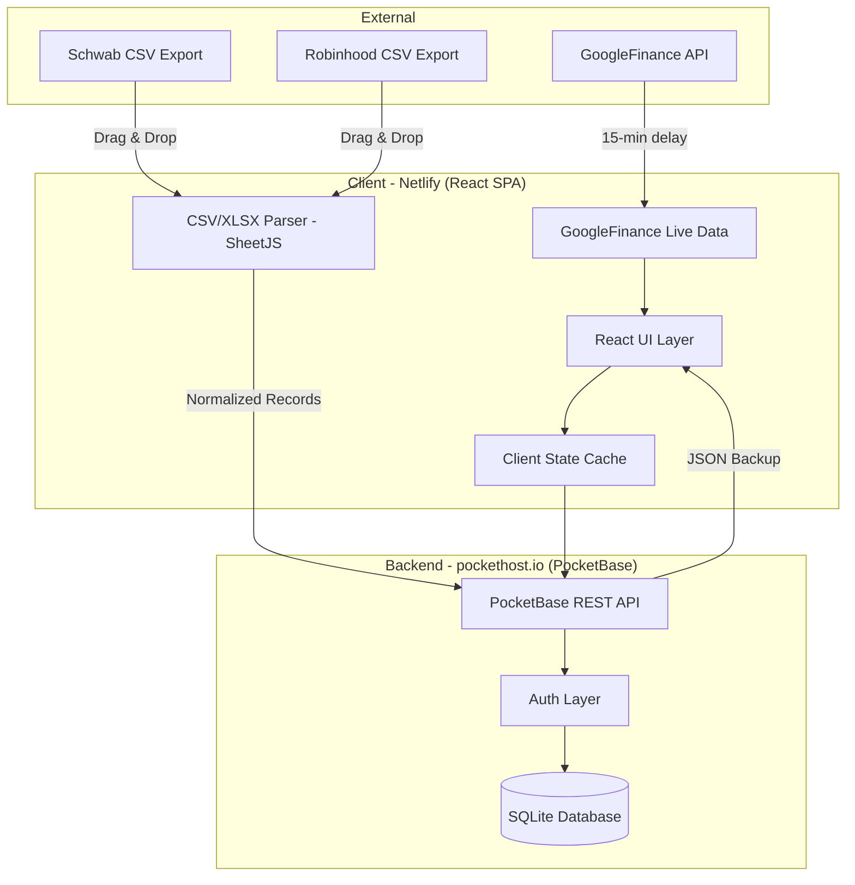
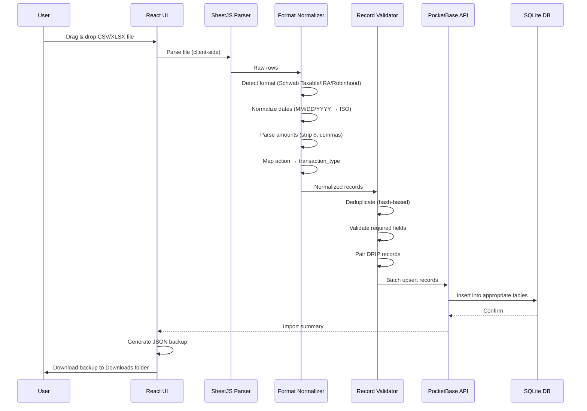
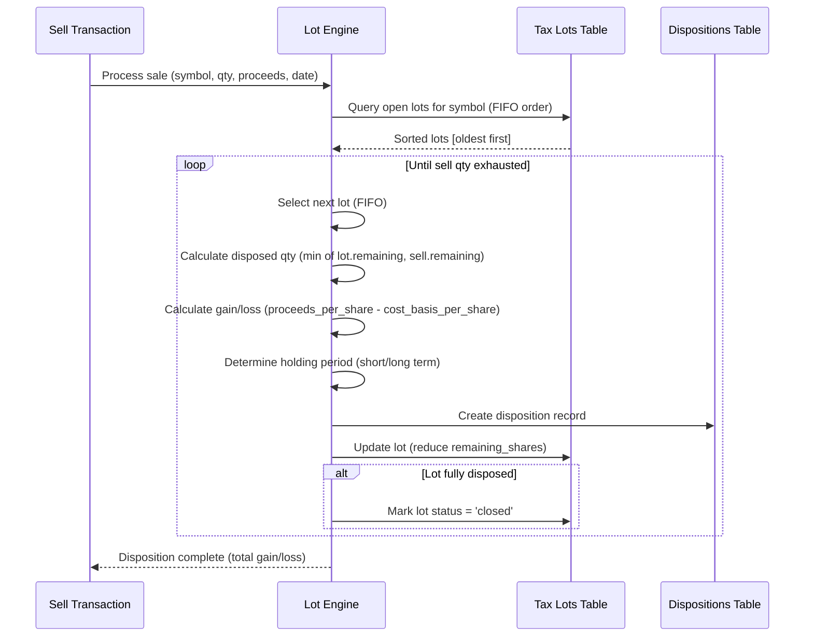
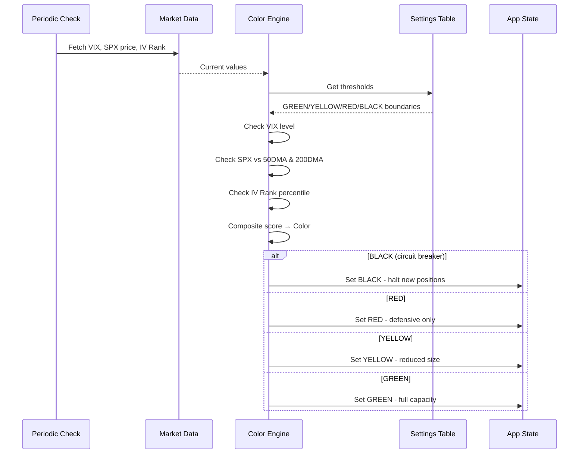

# Design Document: Investment Workbook

## Overview

The Investment Workbook is a personal investment tracking and analytics webapp that consolidates data from 4 brokerage accounts (2 taxable Schwab, 1 Roth IRA Schwab, 1 Traditional IRA Robinhood) into a unified system with tax-lot accounting as the single source of truth. The system supports append-only CSV/XLSX imports with client-side parsing, live market data via GoogleFinance (15-min delay), options trading analytics (put credit spreads on SPX, covered calls, CSPs), and 6 purpose-built dashboards.

The architecture follows a React frontend deployed to Netlify (free tier) with a PocketBase (SQLite) backend on pockethost.io (free tier). All data ingestion happens client-side via drag-and-drop CSV import with SheetJS parsing, with automatic JSON backup to Downloads after each import. The system is accessed via URL in Chrome on desktop and iPhone — no App Store distribution, no terminal required.

The design is settings-driven: all thresholds, color codes, lot selection methods, and display preferences are stored in a settings table, making the system highly configurable without code changes.

## Architecture



## Sequence Diagrams

### CSV Import Flow



### Tax-Lot Disposition (FIFO)



### Market Condition Color Calculation



## Components and Interfaces

### Component 1: CSV Import Pipeline

**Purpose**: Parses, normalizes, and validates CSV/XLSX files from Schwab and Robinhood into canonical transaction records.

**Interface**:
```typescript
interface CSVImportPipeline {
  detectFormat(file: File): Promise<BrokerFormat>;
  parseFile(file: File, format: BrokerFormat): Promise<RawRow[]>;
  normalizeRecords(rows: RawRow[], format: BrokerFormat, accountId: string): NormalizedRecord[];
  validateAndDeduplicate(records: NormalizedRecord[]): ValidationResult;
  importRecords(validated: NormalizedRecord[]): Promise<ImportSummary>;
  generateBackup(importedData: NormalizedRecord[]): JsonBackup;
}

type BrokerFormat = 
  | 'schwab_taxable'      // Schwab brokerage (2 accounts)
  | 'schwab_roth_ira'     // Schwab Roth IRA
  | 'robinhood_trad_ira'; // Robinhood Traditional IRA

interface RawRow {
  [key: string]: string; // Raw CSV columns
}

interface NormalizedRecord {
  hash: string;               // SHA-256 of canonical fields for dedup
  account_id: string;
  transaction_date: string;   // ISO 8601
  settlement_date?: string;   // ISO 8601
  transaction_type: TransactionType;
  symbol?: string;
  description: string;
  quantity?: number;
  price_per_unit?: number;
  total_amount: number;
  fees?: number;
  source_format: BrokerFormat;
  raw_action: string;         // Original action string from CSV
}
```

**Responsibilities**:
- Detect broker format from CSV header row structure
- Handle 4 different column layouts (Schwab has 3 formats, Robinhood has 1)
- Normalize dates from MM/DD/YYYY to ISO 8601
- Strip currency symbols and commas from amounts
- Map broker-specific action strings to canonical TransactionTypes
- Pair DRIP dividend+reinvestment records
- Handle stock split detection and lot adjustment
- Compute deduplication hashes to prevent re-import

### Component 2: Tax-Lot Accounting Engine

**Purpose**: Maintains immutable tax lots as the source of truth, processes dispositions using FIFO lot selection, and tracks cost basis.

**Interface**:
```typescript
interface TaxLotEngine {
  createLot(purchase: PurchaseRecord): TaxLot;
  disposeLots(sale: SaleRecord, method?: LotSelectionMethod): Disposition[];
  adjustLotsForSplit(symbol: string, splitRatio: number, splitDate: string): void;
  getOpenLots(accountId: string, symbol?: string): TaxLot[];
  getCostBasis(accountId: string, symbol?: string): CostBasisSummary;
  getHoldingPeriod(lot: TaxLot, dispositionDate: string): 'short_term' | 'long_term';
}

type LotSelectionMethod = 'fifo' | 'lifo' | 'specific_id'; // Default: fifo from settings

interface TaxLot {
  id: string;
  account_id: string;
  symbol: string;
  acquisition_date: string;
  shares_acquired: number;
  remaining_shares: number;
  cost_per_share: number;
  total_cost_basis: number;
  acquisition_type: AcquisitionType;
  status: 'open' | 'partial' | 'closed';
  drip_source_dividend_id?: string;
  split_adjusted: boolean;
  original_shares?: number;
  original_cost_per_share?: number;
}

type AcquisitionType = 'buy' | 'drip' | 'transfer_in' | 'exercise' | 'split_adjustment';

interface Disposition {
  id: string;
  lot_id: string;
  disposition_date: string;
  shares_disposed: number;
  proceeds_per_share: number;
  cost_basis_per_share: number;
  gain_loss: number;
  holding_period: 'short_term' | 'long_term';
  wash_sale_disallowed?: number;
}
```

**Responsibilities**:
- Create immutable lot records on every purchase/DRIP/transfer
- Process sales using FIFO (configurable) lot selection
- Track partial dispositions across multiple lots
- Adjust lots for stock splits (maintaining original cost basis)
- Calculate short-term vs long-term holding periods (1-year boundary)
- Support wash sale detection (31-day window)
- Maintain audit trail linking dispositions back to lots

### Component 3: Options Position Tracker

**Purpose**: Tracks options positions including put credit spreads on SPX, covered calls, CSPs, roll chains, and assignment/expiration outcomes.

**Interface**:
```typescript
interface OptionsTracker {
  openPosition(trade: OptionTrade): OptionPosition;
  closePosition(positionId: string, closeTrade: OptionTrade): ClosedOptionResult;
  rollPosition(positionId: string, closeTrade: OptionTrade, newTrade: OptionTrade): RollResult;
  handleExpiration(positionId: string, outcome: ExpirationOutcome): void;
  handleAssignment(positionId: string, assignmentDetails: AssignmentDetails): void;
  getSpreadPositions(accountId: string): SpreadPosition[];
  getRollChain(positionId: string): RollChainEntry[];
}

interface OptionPosition {
  id: string;
  account_id: string;
  symbol: string;                // Underlying
  option_symbol: string;         // Full OCC symbol
  option_type: 'call' | 'put';
  direction: 'long' | 'short';
  strike: number;
  expiration_date: string;
  contracts: number;
  premium_received?: number;     // For short positions
  premium_paid?: number;         // For long positions
  status: 'open' | 'closed' | 'expired' | 'assigned' | 'rolled';
  spread_id?: string;            // Links legs of a spread
  roll_chain_id?: string;        // Links rolled positions
  opened_date: string;
  closed_date?: string;
}

interface SpreadPosition {
  id: string;
  spread_type: 'put_credit_spread' | 'call_credit_spread' | 'covered_call' | 'csp';
  short_leg: OptionPosition;
  long_leg?: OptionPosition;     // Undefined for naked/covered
  underlying_symbol: string;
  net_credit: number;
  max_loss: number;
  collateral_required: number;
  breakeven: number;
}

type ExpirationOutcome = 'worthless' | 'itm_assigned' | 'itm_exercised';
```

**Responsibilities**:
- Parse option symbols from both Schwab and Robinhood formats
- Link spread legs together (short put + long put = put credit spread)
- Track roll chains across multiple expirations
- Calculate P&L for individual positions and spreads
- Handle assignment flows (CSP → stock acquisition, covered call → disposition)
- Track collateral requirements per position

### Component 4: Trade Capacity Engine

**Purpose**: Manages slot-based collateral allocation for SPX put credit spreads, enforcing position limits based on market conditions.

**Interface**:
```typescript
interface TradeCapacityEngine {
  getAvailableSlots(accountId: string): SlotAvailability;
  reserveSlot(accountId: string, spread: SpreadProposal): SlotReservation;
  releaseSlot(reservationId: string): void;
  getCapacityByColor(marketColor: MarketColor): CapacityLimits;
  calculateCollateralUsage(accountId: string): CollateralSummary;
}

interface SlotAvailability {
  total_slots: number;              // From settings
  used_slots: number;
  available_slots: number;
  max_allowed_by_market_color: number;
  collateral_per_slot: number;      // e.g., $5,000 per 50-pt wide spread
  total_collateral_committed: number;
  total_collateral_available: number;
}

type MarketColor = 'GREEN' | 'YELLOW' | 'RED' | 'BLACK';

interface CapacityLimits {
  color: MarketColor;
  max_new_positions: number;        // GREEN=full, YELLOW=half, RED=1, BLACK=0
  max_total_positions: number;
  spread_width_cap: number;         // Max spread width in points
  dte_minimum: number;              // Minimum days to expiration
  delta_maximum: number;            // Max short delta
}
```

**Responsibilities**:
- Enforce slot limits based on current market color
- Calculate collateral per slot (spread width × contracts × 100)
- Prevent over-allocation of buying power
- Adjust limits dynamically as market color changes
- Track slot utilization across accounts

### Component 5: Market Condition Color System

**Purpose**: Automatically calculates market regime (GREEN/YELLOW/RED/BLACK) from VIX levels, SPX moving averages, and IV rank.

**Interface**:
```typescript
interface MarketColorSystem {
  calculateColor(marketData: MarketSnapshot): MarketColor;
  getColorHistory(days: number): ColorHistoryEntry[];
  getThresholds(): ColorThresholds;
  updateThresholds(newThresholds: Partial<ColorThresholds>): void;
}

interface MarketSnapshot {
  vix_level: number;
  spx_price: number;
  spx_50dma: number;
  spx_200dma: number;
  iv_rank: number;              // 0-100 percentile
  timestamp: string;
}

interface ColorThresholds {
  // GREEN: Normal conditions
  green_vix_max: number;        // e.g., 18
  green_spx_above_50dma: boolean;
  green_spx_above_200dma: boolean;
  
  // YELLOW: Elevated caution
  yellow_vix_max: number;       // e.g., 25
  yellow_spx_below_50dma: boolean;
  
  // RED: High stress
  red_vix_max: number;          // e.g., 35
  red_spx_below_200dma: boolean;
  
  // BLACK: Circuit breaker (any one triggers)
  black_vix_above: number;      // e.g., 35
  black_spx_drop_pct: number;   // e.g., -5% intraday
}
```

**Responsibilities**:
- Fetch market data from GoogleFinance (15-min delay)
- Apply threshold logic from settings table
- Determine composite market color
- Emit color change events for capacity engine
- Maintain color history for analytics

### Component 6: Dashboard System

**Purpose**: Renders 6 purpose-built dashboards with real-time calculations and portfolio analytics.

**Interface**:
```typescript
interface DashboardSystem {
  getAccountingDashboard(filters: DashboardFilters): AccountingView;
  getTraderDashboard(filters: DashboardFilters): TraderView;
  getRetirementDashboard(): RetirementView;
  getIncomeDashboard(period: TimePeriod): IncomeView;
  getTaxDashboard(taxYear: number): TaxView;
  getRiskDashboard(): RiskView;
}

interface AccountingView {
  positions: PositionSummary[];
  cost_basis_total: number;
  market_value_total: number;
  unrealized_gain_loss: number;
  realized_gain_loss_ytd: number;
  dividends_ytd: number;
  net_worth: NetWorthCalculation;
}

interface TraderView {
  market_color: MarketColor;
  open_spreads: SpreadPosition[];
  slot_availability: SlotAvailability;
  recent_trades: OptionTrade[];
  win_rate: WinRateStats;
  capital_efficiency: number;
  roll_opportunities: RollOpportunity[];
}

interface RetirementView {
  roth_ira: IRAStatus;
  traditional_ira: IRAStatus;
  contribution_room: ContributionRoom;
  rmd_projections?: RMDProjection[];
  tax_adjusted_value: number;
}

interface IncomeView {
  dividend_income: DividendSummary;
  options_income: OptionsIncomeSummary;
  interest_income: number;
  total_investment_income: number;
  hourly_equivalent_40hr: number;  // Income ÷ (52 × 40)
  hourly_equivalent_24hr: number;  // Income ÷ (52 × 24)
}

interface TaxView {
  short_term_gains: number;
  long_term_gains: number;
  qualified_dividends: number;
  ordinary_dividends: number;
  wash_sales: WashSaleEntry[];
  estimated_tax_liability: number;
  tax_loss_harvest_opportunities: TLHOpportunity[];
}

interface RiskView {
  portfolio_beta: number;
  max_drawdown: number;
  concentration_risk: ConcentrationEntry[];
  correlation_matrix: number[][];
  var_95: number;               // Value at Risk (95% confidence)
  stress_test_results: StressTestResult[];
}
```

**Responsibilities**:
- Aggregate data across all 4 accounts for unified views
- Calculate real-time P&L using live GoogleFinance prices
- Compute XIRR for time-weighted returns
- Generate income equivalency comparisons
- Identify tax-loss harvesting opportunities
- Provide risk metrics and concentration analysis

## Data Models

### Tax Lot

```typescript
interface TaxLotRecord {
  id: string;                       // PocketBase auto-generated
  account_id: string;               // FK to accounts
  symbol: string;                   // Ticker symbol
  instrument_id: string;            // FK to instruments
  acquisition_date: string;         // ISO date
  settlement_date: string;          // ISO date (T+1 for stocks)
  shares_acquired: number;          // Original quantity
  remaining_shares: number;         // Current open quantity
  cost_per_share: number;           // Per-share cost basis
  total_cost_basis: number;         // shares_acquired × cost_per_share + fees
  acquisition_type: AcquisitionType;
  status: 'open' | 'partial' | 'closed';
  fees: number;                     // Commission + SEC fees
  source_transaction_hash: string;  // Links to import record
  drip_source_dividend_id?: string; // If DRIP, links to dividend record
  split_adjusted: boolean;          // Whether lot has been split-adjusted
  original_shares?: number;         // Pre-split quantity
  original_cost_per_share?: number; // Pre-split cost basis
  created: string;                  // PocketBase timestamp
  updated: string;                  // PocketBase timestamp
}
```

**Validation Rules**:
- `remaining_shares` ≥ 0 and ≤ `shares_acquired`
- `cost_per_share` > 0
- `acquisition_date` ≤ current date
- `status` must reflect `remaining_shares` (0 = closed, partial if < acquired, open if = acquired)
- `total_cost_basis` = `shares_acquired` × `cost_per_share` + `fees`

### Option Position

```typescript
interface OptionPositionRecord {
  id: string;
  account_id: string;
  underlying_symbol: string;          // e.g., "SPX", "AAPL"
  option_symbol: string;              // OCC format: SPX240119P04800000
  option_type: 'call' | 'put';
  direction: 'long' | 'short';
  strike_price: number;
  expiration_date: string;            // ISO date
  contracts: number;
  premium_per_contract: number;       // Per-contract premium (÷100 for per-share)
  total_premium: number;              // contracts × premium_per_contract × 100
  status: 'open' | 'closed' | 'expired' | 'assigned' | 'rolled';
  spread_id?: string;                 // FK to option_spreads
  roll_chain_id?: string;             // Groups rolled positions
  opened_date: string;
  closed_date?: string;
  close_premium?: number;             // Premium paid/received to close
  pnl?: number;                       // Realized P&L on close
  assignment_lot_id?: string;         // If assigned, links to created tax lot
  source_transaction_hash: string;
  created: string;
  updated: string;
}
```

**Validation Rules**:
- `contracts` > 0
- `strike_price` > 0
- `expiration_date` > `opened_date`
- If `status` = 'closed', `closed_date` must be set
- If `spread_id` set, matching spread record must exist
- `total_premium` = `contracts` × `premium_per_contract` × 100

### Account

```typescript
interface AccountRecord {
  id: string;
  name: string;                       // Display name
  broker: 'schwab' | 'robinhood';
  account_type: 'taxable' | 'roth_ira' | 'traditional_ira';
  account_number_last4: string;       // Last 4 digits only
  tax_status: 'taxable' | 'tax_deferred' | 'tax_free';
  is_active: boolean;
  default_lot_method: LotSelectionMethod;
  created: string;
  updated: string;
}
```

**Validation Rules**:
- Exactly 4 accounts expected (2 taxable Schwab, 1 Roth Schwab, 1 Traditional Robinhood)
- `account_number_last4` is exactly 4 digits
- `tax_status` must align with `account_type`

### Settings

```typescript
interface SettingsRecord {
  id: string;
  key: string;                        // Unique setting key
  value: string;                      // JSON-encoded value
  category: SettingsCategory;
  description: string;
  created: string;
  updated: string;
}

type SettingsCategory = 
  | 'market_color'      // VIX/SPX thresholds
  | 'trade_capacity'    // Slot limits, spread widths
  | 'tax'              // Wash sale window, holding period
  | 'display'          // Dashboard preferences
  | 'import'           // CSV format configs
  | 'performance'      // XIRR parameters, benchmarks
  | 'risk';            // Position limits, concentration caps
```

### CSV Import Log

```typescript
interface CSVImportLogRecord {
  id: string;
  filename: string;
  format_detected: BrokerFormat;
  account_id: string;
  import_date: string;
  records_total: number;
  records_new: number;
  records_duplicate: number;
  records_error: number;
  errors: ImportError[];              // JSON array of errors
  file_hash: string;                  // SHA-256 of entire file for dedup
  backup_generated: boolean;
  created: string;
}

interface ImportError {
  row_number: number;
  field: string;
  value: string;
  error: string;
}
```

### Dividend Record

```typescript
interface DividendRecord {
  id: string;
  account_id: string;
  symbol: string;
  ex_date: string;
  pay_date: string;
  record_date?: string;
  amount_per_share: number;
  total_amount: number;
  shares_held_at_ex: number;
  classification: 'qualified' | 'ordinary' | 'return_of_capital' | 'section_199a';
  is_drip: boolean;
  drip_lot_id?: string;              // FK to tax_lot created by reinvestment
  tax_year: number;
  form_1099_amount?: number;         // For reconciliation
  source_transaction_hash: string;
  created: string;
  updated: string;
}
```

### Stock Split Record

```typescript
interface StockSplitRecord {
  id: string;
  symbol: string;
  split_date: string;
  ratio_from: number;                 // e.g., 1 (1-for-4 reverse: from=4, to=1)
  ratio_to: number;                   // e.g., 4 (4-for-1 forward: from=1, to=4)
  effective_date: string;
  lots_adjusted: number;              // Count of lots modified
  applied: boolean;
  applied_date?: string;
  created: string;
}
```

## Algorithmic Pseudocode

### CSV Format Detection Algorithm

```typescript
/**
 * ALGORITHM: detectBrokerFormat
 * INPUT: headerRow - first row of CSV file as string array
 * OUTPUT: BrokerFormat enum value
 * 
 * PRECONDITIONS:
 *   - headerRow is non-empty string array
 *   - File has been successfully read and first row extracted
 * 
 * POSTCONDITIONS:
 *   - Returns exactly one BrokerFormat value
 *   - Throws FormatDetectionError if no format matches
 */
function detectBrokerFormat(headerRow: string[]): BrokerFormat {
  const normalized = headerRow.map(h => h.trim().toLowerCase());
  
  // Schwab format detection: has "Action" and "Symbol" columns
  if (normalized.includes('action') && normalized.includes('symbol')) {
    // Distinguish taxable vs IRA by presence of specific columns
    if (normalized.includes('fees & comm')) {
      return 'schwab_taxable';
    }
    return 'schwab_roth_ira';
  }
  
  // Robinhood format: has "Activity Type" and "Instrument" columns
  if (normalized.includes('activity type') && normalized.includes('instrument')) {
    return 'robinhood_trad_ira';
  }
  
  throw new FormatDetectionError('Unable to detect CSV format from headers');
}
```

### FIFO Lot Disposition Algorithm

```typescript
/**
 * ALGORITHM: disposeLotsFIFO
 * INPUT: sale - SaleRecord with symbol, quantity, proceeds, date
 *        openLots - Array of TaxLot sorted by acquisition_date ASC (FIFO)
 * OUTPUT: Array of Disposition records
 * 
 * PRECONDITIONS:
 *   - sale.quantity > 0
 *   - sale.proceeds_per_share > 0
 *   - openLots contains only lots with status 'open' or 'partial'
 *   - openLots is sorted by acquisition_date ascending (FIFO order)
 *   - Sum of openLots[].remaining_shares >= sale.quantity
 * 
 * POSTCONDITIONS:
 *   - Sum of all dispositions[].shares_disposed === sale.quantity
 *   - Each disposition references a valid lot_id
 *   - Each affected lot's remaining_shares is reduced accordingly
 *   - Lots with remaining_shares === 0 have status set to 'closed'
 *   - Each disposition has correct holding_period based on 1-year rule
 * 
 * LOOP INVARIANT:
 *   - remainingToSell + sum(dispositions[].shares_disposed) === sale.quantity
 *   - All previously created dispositions are valid and complete
 */
function disposeLotsFIFO(sale: SaleRecord, openLots: TaxLot[]): Disposition[] {
  const dispositions: Disposition[] = [];
  let remainingToSell = sale.quantity;
  let lotIndex = 0;

  while (remainingToSell > 0 && lotIndex < openLots.length) {
    // INVARIANT: remainingToSell + sum(disposed) === sale.quantity
    const lot = openLots[lotIndex];
    const disposedQty = Math.min(lot.remaining_shares, remainingToSell);
    
    const holdingDays = daysBetween(lot.acquisition_date, sale.date);
    const holdingPeriod: 'short_term' | 'long_term' = 
      holdingDays > 365 ? 'long_term' : 'short_term';
    
    const gainLoss = (sale.proceeds_per_share - lot.cost_per_share) * disposedQty;
    
    dispositions.push({
      id: generateId(),
      lot_id: lot.id,
      disposition_date: sale.date,
      shares_disposed: disposedQty,
      proceeds_per_share: sale.proceeds_per_share,
      cost_basis_per_share: lot.cost_per_share,
      gain_loss: gainLoss,
      holding_period: holdingPeriod,
    });
    
    // Update lot state
    lot.remaining_shares -= disposedQty;
    lot.status = lot.remaining_shares === 0 ? 'closed' : 'partial';
    
    remainingToSell -= disposedQty;
    lotIndex++;
  }

  if (remainingToSell > 0) {
    throw new InsufficientLotsError(
      `Cannot sell ${sale.quantity} shares of ${sale.symbol}: only ${sale.quantity - remainingToSell} available in open lots`
    );
  }

  return dispositions;
}
```

### DRIP Pairing Algorithm

```typescript
/**
 * ALGORITHM: pairDripRecords
 * INPUT: records - Array of NormalizedRecord from a single import batch
 * OUTPUT: Paired records with dividend linked to reinvestment lot
 * 
 * PRECONDITIONS:
 *   - Records are from same account and sorted by transaction_date
 *   - DRIP dividends and reinvestments appear in sequence
 * 
 * POSTCONDITIONS:
 *   - Each DRIP dividend record is paired with its reinvestment
 *   - Unpaired dividends (cash dividends) remain standalone
 *   - Created tax lots reference their source dividend
 * 
 * LOOP INVARIANT:
 *   - All records before current index have been processed or queued
 */
function pairDripRecords(records: NormalizedRecord[]): PairedResult {
  const paired: DripPair[] = [];
  const unpaired: NormalizedRecord[] = [];
  const pendingDividends: Map<string, NormalizedRecord> = new Map();

  for (const record of records) {
    if (record.transaction_type === 'dividend') {
      // Key: symbol + date (DRIP reinvestment occurs same day)
      const key = `${record.symbol}_${record.transaction_date}`;
      pendingDividends.set(key, record);
    } 
    else if (record.transaction_type === 'reinvestment') {
      const key = `${record.symbol}_${record.transaction_date}`;
      const dividendRecord = pendingDividends.get(key);
      
      if (dividendRecord) {
        paired.push({
          dividend: dividendRecord,
          reinvestment: record,
          shares_acquired: record.quantity!,
          cost_per_share: record.price_per_unit!,
        });
        pendingDividends.delete(key);
      } else {
        // Reinvestment without matching dividend — flag for review
        unpaired.push(record);
      }
    }
    else {
      unpaired.push(record);
    }
  }

  // Remaining pending dividends are cash dividends (no reinvestment)
  for (const [, div] of pendingDividends) {
    unpaired.push(div);
  }

  return { paired, unpaired };
}
```

### Market Color Calculation Algorithm

```typescript
/**
 * ALGORITHM: calculateMarketColor
 * INPUT: snapshot - Current market data (VIX, SPX, MAs, IV Rank)
 *        thresholds - Color boundary settings
 * OUTPUT: MarketColor (GREEN | YELLOW | RED | BLACK)
 * 
 * PRECONDITIONS:
 *   - snapshot contains valid numeric values
 *   - thresholds are loaded from settings table
 *   - VIX >= 0, SPX > 0, IV Rank in [0, 100]
 * 
 * POSTCONDITIONS:
 *   - Returns exactly one MarketColor
 *   - BLACK takes priority (circuit breaker)
 *   - Colors are mutually exclusive and exhaustive
 *   - Result is deterministic for same inputs
 */
function calculateMarketColor(
  snapshot: MarketSnapshot, 
  thresholds: ColorThresholds
): MarketColor {
  // BLACK: Circuit breaker — any single condition triggers
  if (snapshot.vix_level > thresholds.black_vix_above) return 'BLACK';
  
  const spxDropPct = ((snapshot.spx_price - snapshot.spx_200dma) / snapshot.spx_200dma) * 100;
  if (spxDropPct < thresholds.black_spx_drop_pct) return 'BLACK';

  // RED: High stress — VIX elevated AND below 200DMA
  if (
    snapshot.vix_level > thresholds.red_vix_max &&
    snapshot.spx_price < snapshot.spx_200dma
  ) {
    return 'RED';
  }

  // YELLOW: Caution — VIX moderately elevated OR below 50DMA
  if (
    snapshot.vix_level > thresholds.green_vix_max ||
    snapshot.spx_price < snapshot.spx_50dma ||
    snapshot.iv_rank > 50
  ) {
    return 'YELLOW';
  }

  // GREEN: Normal conditions — all clear
  return 'GREEN';
}
```

### Stock Split Lot Adjustment Algorithm

```typescript
/**
 * ALGORITHM: adjustLotsForSplit
 * INPUT: symbol - Stock ticker that split
 *        ratioFrom - Original shares (e.g., 1 for 4:1 split)
 *        ratioTo - New shares (e.g., 4 for 4:1 split)
 *        splitDate - Effective date of split
 * OUTPUT: Number of lots adjusted
 * 
 * PRECONDITIONS:
 *   - ratioFrom > 0 and ratioTo > 0
 *   - ratioFrom !== ratioTo
 *   - splitDate is valid ISO date
 *   - Lots exist for the given symbol
 * 
 * POSTCONDITIONS:
 *   - All open/partial lots acquired before splitDate are adjusted
 *   - New shares = old shares × (ratioTo / ratioFrom)
 *   - New cost_per_share = old cost_per_share × (ratioFrom / ratioTo)
 *   - total_cost_basis remains unchanged (cost basis preservation)
 *   - Original values stored in original_shares, original_cost_per_share
 *   - split_adjusted flag set to true
 * 
 * INVARIANT:
 *   - For each lot: total_cost_basis (before) === total_cost_basis (after)
 */
function adjustLotsForSplit(
  symbol: string,
  ratioFrom: number,
  ratioTo: number,
  splitDate: string
): number {
  const multiplier = ratioTo / ratioFrom;
  const lots = getLots({ symbol, status: ['open', 'partial'], acquiredBefore: splitDate });
  let adjustedCount = 0;

  for (const lot of lots) {
    // Preserve original values
    lot.original_shares = lot.shares_acquired;
    lot.original_cost_per_share = lot.cost_per_share;
    
    // Adjust quantities
    lot.shares_acquired = lot.shares_acquired * multiplier;
    lot.remaining_shares = lot.remaining_shares * multiplier;
    
    // Adjust cost basis per share (total cost basis stays same)
    lot.cost_per_share = lot.cost_per_share / multiplier;
    
    // INVARIANT CHECK: total_cost_basis unchanged
    // lot.shares_acquired * lot.cost_per_share === lot.total_cost_basis
    
    lot.split_adjusted = true;
    adjustedCount++;
  }

  return adjustedCount;
}
```

## Key Functions with Formal Specifications

### Function: parseAmount()

```typescript
function parseAmount(raw: string): number
```

**Preconditions:**
- `raw` is a non-null string
- `raw` may contain `$`, `,`, `(`, `)`, spaces, or negative sign

**Postconditions:**
- Returns numeric value
- Strips `$` and `,` characters
- Parenthesized values return negative: `($1,234.56)` → `-1234.56`
- Empty/whitespace-only string returns `0`
- Non-parseable strings throw `ParseError`

### Function: normalizeDate()

```typescript
function normalizeDate(raw: string, format: BrokerFormat): string
```

**Preconditions:**
- `raw` is non-null string containing a date
- Schwab format: `MM/DD/YYYY` or `MM/DD/YYYY as of MM/DD/YYYY`
- Robinhood format: `YYYY-MM-DD` or `MM/DD/YYYY`

**Postconditions:**
- Returns ISO 8601 date string (`YYYY-MM-DD`)
- Schwab "as of" dates use the first date (transaction date)
- Invalid dates throw `DateParseError` with original value

### Function: mapActionToType()

```typescript
function mapActionToType(action: string, format: BrokerFormat): TransactionType
```

**Preconditions:**
- `action` is the raw action/activity string from CSV
- `format` identifies which mapping table to use

**Postconditions:**
- Returns canonical `TransactionType`
- Schwab mappings: "Buy" → buy, "Sell" → sell, "Qual Div" → dividend, "Reinvest Shares" → reinvestment, "Stock Split" → split
- Robinhood mappings: "BUY" → buy, "SELL" → sell, "DIV" → dividend, "CDIV" → dividend
- Unmapped actions throw `UnknownActionError` with the raw value

### Function: parseOptionSymbol()

```typescript
function parseOptionSymbol(raw: string, format: BrokerFormat): ParsedOption
```

**Preconditions:**
- `raw` is a non-null option symbol string
- Schwab format: `SPX 01/19/2024 4800.00 P` (space-delimited)
- Robinhood format: `SPX240119P04800000` (OCC standard, no spaces)

**Postconditions:**
- Returns `ParsedOption` with underlying, expiration, strike, type
- Schwab: splits on spaces, parses date as MM/DD/YYYY, last char is type
- Robinhood: first 1-6 chars = underlying, next 6 = YYMMDD, next 1 = C/P, last 8 = strike×1000
- Invalid formats throw `OptionParseError`

**Loop Invariants:** N/A (no loops)

### Function: computeRecordHash()

```typescript
function computeRecordHash(record: NormalizedRecord): string
```

**Preconditions:**
- `record` has all required fields populated
- Fields used for hash: account_id, transaction_date, transaction_type, symbol, quantity, total_amount

**Postconditions:**
- Returns SHA-256 hex string (64 chars)
- Same logical transaction always produces same hash (deterministic)
- Different transactions produce different hashes (collision-resistant)
- Hash is independent of import order or file format

### Function: calculateXIRR()

```typescript
function calculateXIRR(cashFlows: CashFlow[]): number
```

**Preconditions:**
- `cashFlows` contains at least one negative (investment) and one positive (return) value
- Each cashFlow has `amount` (number) and `date` (ISO string)
- Cash flows are not all on the same date
- Dates span at least 1 day

**Postconditions:**
- Returns annualized internal rate of return as decimal (e.g., 0.12 = 12%)
- Uses Newton-Raphson iteration (max 100 iterations, tolerance 1e-7)
- Throws `XIRRConvergenceError` if no solution found within tolerance

## Example Usage

```typescript
// Example 1: Import a Schwab CSV file
const file = event.dataTransfer.files[0];
const pipeline = new CSVImportPipeline(pocketbaseClient);

const format = await pipeline.detectFormat(file);
// format === 'schwab_taxable'

const rawRows = await pipeline.parseFile(file, format);
// rawRows: [{Date: '01/15/2024', Action: 'Buy', Symbol: 'AAPL', ...}, ...]

const normalized = pipeline.normalizeRecords(rawRows, format, 'acct_schwab_1');
// normalized: [{transaction_date: '2024-01-15', transaction_type: 'buy', symbol: 'AAPL', ...}]

const validation = pipeline.validateAndDeduplicate(normalized);
// validation: {valid: 45, duplicates: 3, errors: [{row: 12, error: 'missing symbol'}]}

const summary = await pipeline.importRecords(validation.validRecords);
// summary: {lots_created: 12, dispositions: 5, dividends: 8, options: 3}

const backup = pipeline.generateBackup(validation.validRecords);
// Triggers download of investment_backup_2024-01-20.json


// Example 2: Process a stock sale with FIFO disposition
const sale: SaleRecord = {
  account_id: 'acct_schwab_1',
  symbol: 'AAPL',
  quantity: 50,
  proceeds_per_share: 185.50,
  date: '2024-06-15',
  fees: 0.02,
};

const engine = new TaxLotEngine(pocketbaseClient);
const dispositions = engine.disposeLots(sale);
// dispositions: [
//   {lot_id: 'lot_001', shares_disposed: 30, gain_loss: 1500, holding_period: 'long_term'},
//   {lot_id: 'lot_002', shares_disposed: 20, gain_loss: 800, holding_period: 'short_term'},
// ]


// Example 3: Check trade capacity before opening new spread
const capacity = new TradeCapacityEngine(pocketbaseClient);
const availability = capacity.getAvailableSlots('acct_schwab_1');
// availability: {total_slots: 10, used_slots: 6, available_slots: 4, max_allowed_by_market_color: 4}

if (availability.available_slots > 0) {
  const reservation = capacity.reserveSlot('acct_schwab_1', {
    spread_type: 'put_credit_spread',
    underlying: 'SPX',
    short_strike: 4800,
    long_strike: 4750,
    expiration: '2024-02-16',
    contracts: 1,
  });
}


// Example 4: Calculate market color
const colorSystem = new MarketColorSystem(settingsStore);
const snapshot: MarketSnapshot = {
  vix_level: 22.5,
  spx_price: 4950,
  spx_50dma: 4980,
  spx_200dma: 4750,
  iv_rank: 45,
  timestamp: '2024-01-20T15:30:00Z',
};

const color = colorSystem.calculateColor(snapshot);
// color === 'YELLOW' (VIX > 18 threshold, SPX below 50DMA)


// Example 5: Income hourly equivalents
const income = dashboards.getIncomeDashboard({ year: 2024 });
console.log(`Options income: $${income.options_income.total}`);
console.log(`40hr equivalent: $${income.hourly_equivalent_40hr}/hr`);
console.log(`24hr equivalent: $${income.hourly_equivalent_24hr}/hr`);
```

## Correctness Properties

The following universal properties must hold for the system:

### Property 1: Lot Integrity
For all tax lots `l`: `l.remaining_shares >= 0` AND `l.remaining_shares <= l.shares_acquired`

**Validates: Requirements 2.1**

### Property 2: Disposition Completeness
For every sale transaction of quantity `q`, the sum of `disposition.shares_disposed` across all created dispositions equals exactly `q`

**Validates: Requirements 2.2**

### Property 3: Cost Basis Preservation on Split
For all lots adjusted by a split: `lot.shares_acquired * lot.cost_per_share` (after) === `lot.original_shares * lot.original_cost_per_share` (before)

**Validates: Requirements 2.4**

### Property 4: FIFO Ordering
For any two dispositions `d1`, `d2` from the same sale where `d1.lot.acquisition_date < d2.lot.acquisition_date`, `d1` was created before `d2` (older lots consumed first)

**Validates: Requirements 2.2**

### Property 5: Hash Uniqueness
For any two distinct transactions `t1 ≠ t2`, `computeRecordHash(t1) ≠ computeRecordHash(t2)` with overwhelming probability

**Validates: Requirements 1.4**

### Property 6: Idempotent Import
Importing the same CSV file twice produces zero new records on the second import (all detected as duplicates)

**Validates: Requirements 1.4**

### Property 7: Market Color Exhaustiveness
For all valid `MarketSnapshot` inputs, `calculateMarketColor` returns exactly one of {GREEN, YELLOW, RED, BLACK}

**Validates: Requirements 5.1**

### Property 8: Market Color Priority
BLACK conditions override all other colors. If `vix > black_threshold`, result is always BLACK regardless of other inputs

**Validates: Requirements 5.1**

### Property 9: Spread Collateral Conservation
For all accounts, `sum(open_spreads.collateral_required) <= account.available_buying_power`

**Validates: Requirements 4.3**

### Property 10: Option Premium Sign Convention
For short positions, `premium_received > 0`. For long positions, `premium_paid > 0`. These are never negative.

**Validates: Requirements 3.2**

### Property 11: Holding Period Correctness
A disposition's `holding_period` is 'long_term' if and only if `daysBetween(lot.acquisition_date, disposition.disposition_date) > 365`

**Validates: Requirements 2.3**

### Property 12: Account Type Tax Alignment
For all accounts: if `account_type === 'roth_ira'` then `tax_status === 'tax_free'`; if `account_type === 'traditional_ira'` then `tax_status === 'tax_deferred'`; if `account_type === 'taxable'` then `tax_status === 'taxable'`

**Validates: Requirements 7.4**

### Property 13: DRIP Pair Integrity
For all DRIP lots, `drip_source_dividend_id` references a valid dividend record with matching symbol and date

**Validates: Requirements 1.5**

### Property 14: Slot Capacity Enforcement
Available slots never exceed `max_allowed_by_market_color` for the current market color

**Validates: Requirements 4.2**

### Property 15: Backup Generation
Every successful import (records_new > 0) produces exactly one JSON backup download

**Validates: Requirements 1.6**

## Error Handling

### Error Scenario 1: Unrecognized CSV Format

**Condition**: Header row does not match any known broker format
**Response**: Display user-friendly error with detected headers, suggest checking file source
**Recovery**: User can retry with correct file; no state changes made

### Error Scenario 2: Insufficient Lots for Sale

**Condition**: Sale quantity exceeds total remaining shares across all open lots for symbol
**Response**: Abort entire sale disposition, display discrepancy details
**Recovery**: User must import missing purchase records first, then retry sale processing

### Error Scenario 3: Duplicate Import Detected

**Condition**: File hash matches previously imported file in csv_import_log
**Response**: Warn user that file was already imported, show previous import date/stats
**Recovery**: User can force re-import if needed (e.g., after corrections)

### Error Scenario 4: Option Symbol Parse Failure

**Condition**: Option symbol doesn't match expected Schwab or Robinhood format
**Response**: Log error with raw symbol, skip record, continue processing remaining records
**Recovery**: Flagged records shown in import summary for manual review

### Error Scenario 5: Market Data Unavailable

**Condition**: GoogleFinance data fetch fails or returns stale data (>30 min old)
**Response**: Display last known color with staleness indicator, disable new trade capacity
**Recovery**: Auto-retry on next interval; manual refresh button available

### Error Scenario 6: DRIP Pairing Failure

**Condition**: Reinvestment record found without matching dividend on same date/symbol
**Response**: Create lot without DRIP linkage, flag for user review
**Recovery**: User can manually link dividend and reinvestment records in UI

### Error Scenario 7: Stock Split with No Matching Lots

**Condition**: Split event detected for symbol with no open lots
**Response**: Log split event but take no action on lots
**Recovery**: If lots are imported later with pre-split dates, user can trigger manual split adjustment

## Testing Strategy

### Unit Testing Approach

Focus areas:
- Amount parsing (all currency format variations)
- Date normalization (all broker date formats)
- Action-to-type mapping (complete coverage of all known actions)
- FIFO lot selection and disposition logic
- Market color calculation (boundary conditions)
- Option symbol parsing (both formats)
- Hash computation determinism
- Split adjustment arithmetic

**Framework**: Vitest (aligned with React/Vite toolchain)

### Property-Based Testing Approach

**Property Test Library**: fast-check

Key properties to test:
- Lot disposition always consumes exactly the sale quantity (no over/under)
- Split adjustments preserve total cost basis
- Market color function is total (always returns a valid color)
- Hash function produces consistent output for same input
- FIFO ordering is maintained across all generated lot sequences
- Import idempotency holds for any valid CSV content

### Integration Testing Approach

- End-to-end CSV import → lot creation → sale → disposition flow
- PocketBase CRUD operations for all 14+ tables
- Multi-account aggregation for dashboard calculations
- Option spread lifecycle (open → roll → expire/close)
- Backup generation and JSON structure validation

## Performance Considerations

- **Client-side parsing**: SheetJS handles CSV/XLSX parsing entirely in browser; files up to 10MB should parse in <2 seconds
- **Batch imports**: Records are batched in groups of 50 for PocketBase API calls to avoid rate limits
- **Dashboard calculations**: Computed on-demand with client-side caching (invalidated on new imports)
- **GoogleFinance polling**: Interval-based (every 60 seconds during market hours), not continuous
- **SQLite limitations**: PocketBase free tier has connection limits; all writes are serialized
- **XIRR calculation**: Newton-Raphson converges in <20 iterations for typical portfolios

## Security Considerations

- **No secrets in client**: PocketBase API key stored in environment variable on Netlify, not in client bundle
- **Account numbers**: Only last 4 digits stored; full numbers never persisted
- **Authentication**: PocketBase built-in auth with single user (personal tool)
- **CSV data**: Parsed client-side, never sent to third-party services
- **Backup files**: JSON downloads contain full transaction data; user responsible for securing local files
- **CORS**: PocketBase configured to accept requests only from Netlify deployment URL

## Dependencies

| Package | Purpose | Version Strategy |
|---------|---------|-----------------|
| React | UI framework | ^18.x |
| TypeScript | Type safety | ^5.x |
| Vite | Build tooling | ^5.x |
| PocketBase JS SDK | Backend client | ^0.21.x |
| SheetJS (xlsx) | CSV/XLSX parsing | ^0.20.x |
| fast-check | Property-based testing | ^3.x |
| Vitest | Unit test runner | ^1.x |
| Recharts | Dashboard charts | ^2.x |
| TanStack Query | Data fetching/caching | ^5.x |
| date-fns | Date manipulation | ^3.x |
| crypto-js | SHA-256 hashing | ^4.x |
| Mermaid | Architecture diagrams (docs only) | N/A |
